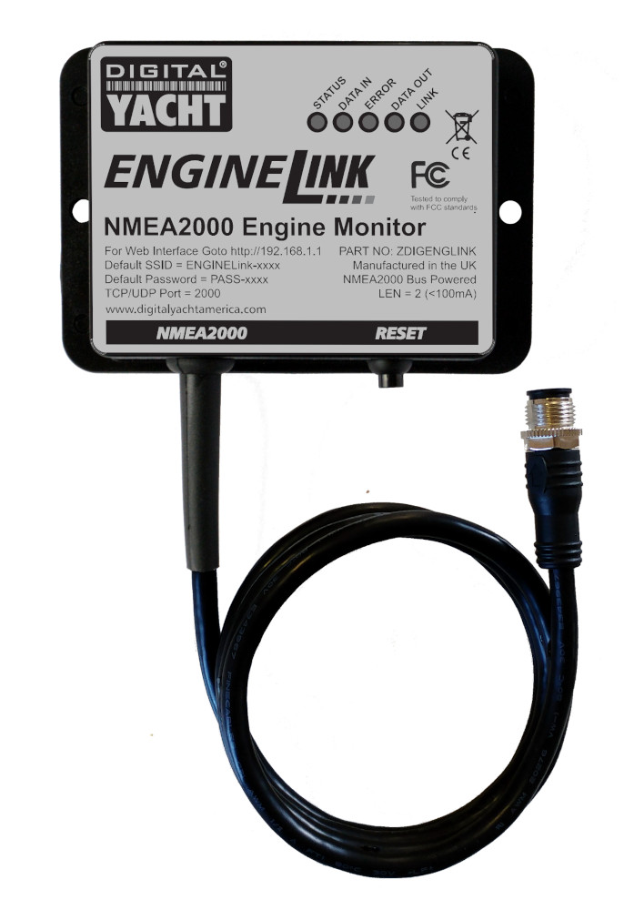
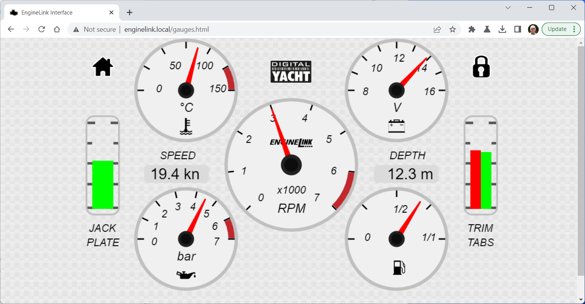
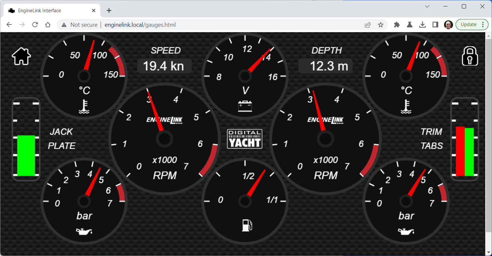
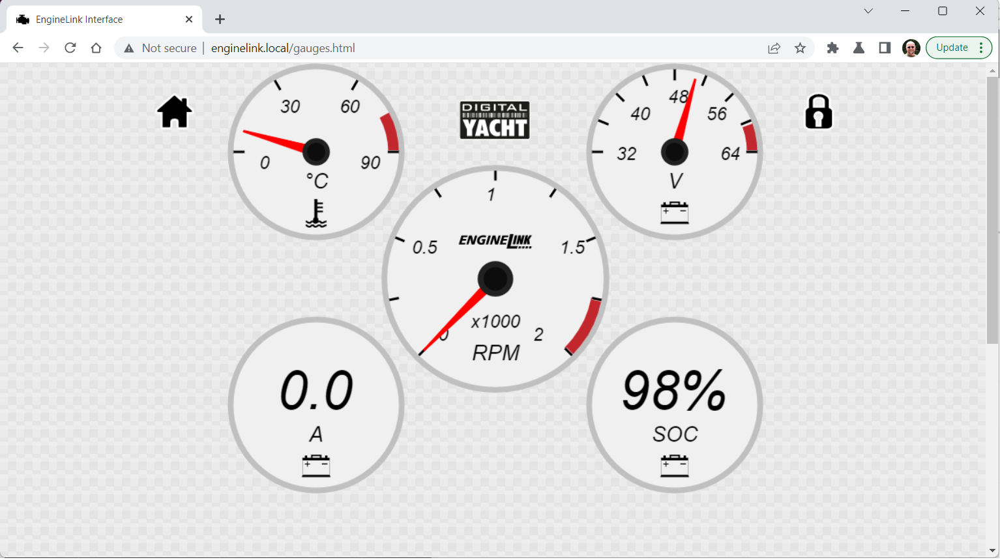

# EngineLink

Welcome to our EngineLink repository on GitHub. Here we will post the latest firmware updates, useful information, configuration files, application notes and any other information that we think will be useful to EngineLink users.

 

 

The EngineLink NMEA2000 Engine Monitor is designed to provide an easy way to display data from an Engine which has an NMEA 2000 interface. This small black box, plugs in to an NMEA 2000 network and creates its own Wireless Network that any modern mobile device can connect to. Then just using a web browser (no special apps) EngineLink produces real time web pages of engine gauges, showing the state of the engine and other critical devices such as; Fuel tanks, Batteries, Trim tabs and Jack Plates.

 

 

Supporting single or dual engines and with a light or dark background option, EngineLink's modern and clear dashboard displays provide a great diagnostic tool for engine installers, boat builders, etc. and for the boat owner, allows a phone or tablet to become a powerful wireless repeater station, that can view the engine status, anywhere onboard the boat.

 

 

EngineLink also supports the new generation of electric engines that are quickly establishing themselves in the market. Initially, with no official Electric Propulsion PGNs from the NMEA Organistation, manufacturers like Bellmarine, Torqeedo and Vetus had to communicate/map the state of their electric engine using the existing combustion engine PGNs. EngineLink already supports this data mapping, and what is more, will be the first product to support the new official NMEA 2000 Electric Propulsion PGNs that were just published in February 2023. 

 

 

We expect to release an "Electric Propulsion Service Pack" update in the next few weeks, which will allow electric engine manufacturers to test their implementations of these new Electric Propulsion PGNs.

Included in this repository are:-

*1.  EngineLink Dealer Information Document*

*2.  The latest EngineLink firmware XF file (V01.02)*

*3.  The latest EngineLink Web Interface XS file (V01.20.00)*

*4.  Latest User Manuals for EngineLink*

*5.  List of PGNs that EngineLink supports* 

